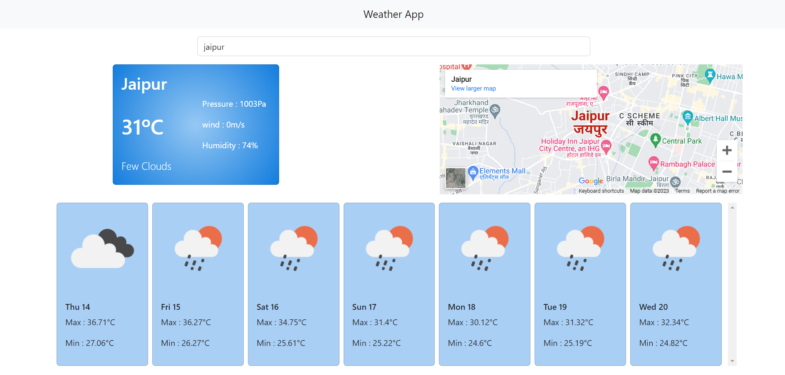

# Weather-APP-JS

This Weather App is a simple web application that allows users to fetch the current weather data for their current location using the GeoLocation API. Additionally, users can search for weather data for any location by typing in the location name. The application uses debouncing to reduce the number of requests sent to the Open Weather Map API, ensuring efficient and responsive weather data retrieval.


## Features

- **Current Location Weather:** The app uses the GeoLocation API to determine the user's current location and displays the current weather conditions.

- **Location Search:** Users can search for weather data of any location by simply typing the location name in the search box.

- **Debouncing:** To optimize API requests, the app uses debouncing, which delays the execution of the search function until the user has finished typing, reducing the number of unnecessary requests.

## Technologies Used

- HTML/CSS
- JavaScript
- GeoLocation API
- Open Weather Map API

## Usage

1. Visit the Weather App website.
2. Allow the app to access your location when prompted or type in a location name.
3. View the current weather data for your location or the location you entered.

## Installation

To run this app locally, follow these steps:

1. Clone this repository:

   ```bash
   git clone https://github.com/Lokendra-debug/Weather-APP-JS.git

# License
This Weather App is open-source software licensed under the MIT License.
